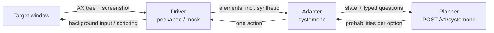

# Architecture · [中文](architecture.zh-CN.md)

One step of a run: observe the target window, ask the planner, act, observe again. The loop
(`deskmind_hands/runtime/loop.py`) owns budgets, cancellation and failure classes; the driver owns the desktop; the
adapter owns the planner. None of them reads the grader's view: the grader sees the filesystem, the planner sees only
what the observation channel gives it.



## Observations and actions

- **Bundle ids, not app names.** On a localised system `--app Finder` fails while `com.apple.finder` works.
- **Frames are derived every time.** Element bounds arrive in global display points, the image is a window crop at its
  own size, and the scale is not a round number (one capture delivered 460×218 for an 820×374 window). The transform
  comes from the capture's reported geometry on every observation (`geometry.py` is the only place it is applied).
- **Actions bind to an observation.** An action names an element of a specific observation; after any action the
  observation is retired, so acting on a stale layout is refused rather than landing on the wrong thing.
- **Indeterminate is its own outcome.** When a write was dispatched but cannot be read back, the step is reported as
  indeterminate ("observe before acting again"), not as a failure the planner would retry.

## Background execution

The driver keeps one Peekaboo MCP session per run (`HANDS_PEEKABOO_TRANSPORT=mcp`). Clicks go to an element of the
current snapshot, text goes in as an accessibility value, chords are delivered to the target window. Your focused app
keeps the keyboard. Where macOS offers no background route, the step is refused with the reason instead of being
performed in the foreground:

- a chord an app cannot receive in the background is not offered to the planner at all (`ROUTED_CHORDS`);
- apps that ignore all background input can be allowed a short **foreground flash** (`HANDS_FLASH_APPS`, a list of
  bundle ids): the app comes forward for about a second, one click, the pointer goes back and your app gets the front
  again. It never happens while you are in that app or have touched the keyboard or mouse in the last 3 s;
- every foreground action is counted in the run record (`driver_state`), because "runs without disturbing you" is a
  claim that has to be measured.

## The projection layer

A planner that reads a list of elements does well on web pages and badly on Finder, where the common operations are
sequences of selections and chords. The projection layer adds synthetic elements, the controls a web page would have:

| App | Synthetic control | Carried out by |
|---|---|---|
| Finder | *move 「file」 to ▾* per file, options = every valid destination | Finder scripting |
| Finder | new-folder name field + *新建文件夹* button | Finder scripting |
| Finder | view mode dropdown; folders as links; an undo button for the last change | Finder scripting |
| TextEdit | *保存* (save), new plain-text document, save-as (name, place, button) | TextEdit scripting |

Each synthetic element is flagged `synthetic`, and each use is counted. Rows that would take the run out of the
workspace (sidebar favourites) are not offered. `HANDS_PROJECTION=0` switches the layer off, which is how a planner is
measured on the raw accessibility tree; the on/off difference answers whether the desktop needs new verbs or only a
new state shape.

## The typed-question planner interface

`adapters/systemone.py` never asks for an action in text. Each step is one request:

```json
{"model": "brain-4b",
 "state": {"page": {"url": "com.apple.finder", "title": "ws", "text": "..."},
           "elements": [...], "recent_actions": [...], "effects_so_far": [...]},
 "questions": {
   "operation":       {"type": "choice", "criteria": {"CLICK": "...", "TYPE_TEXT": "...", "SELECT": "...", "DONE": "..."}},
   "click_target":    {"type": "choice", "criteria": {"...": "..."}},
   "select_target":   {"type": "choice", "criteria": {"...": "..."}},
   "type_text_value": {"type": "choice", "criteria": {"...": "..."}}}}
```

The answer is a probability per option for every question. The adapter executes the most likely operation with its
target; low confidence can be routed to a larger planner. What to type is also a choice: value candidates come from
the goal's quoted strings, dictated lines and on-screen text, since a desktop goal usually names the string it wants.

Operations: `CLICK`, `OPEN`, `TYPE_TEXT`, `REPLACE_TEXT`, `APPEND_TEXT`, `TYPE_FOCUSED`, `SELECT`, `RENAME`, `KEY`,
`SCROLL`, `FOCUS_APP`, `FOCUS_WINDOW`, `ASK`, `ANSWER`, `DONE`, `BLOCKED`. Only the ones that apply to the current
state are offered.

The same API is served locally by [DeskMind Brain](https://github.com/deskmind-ai/brain). Any other server
that is wire-compatible with /v1/systemone can be used with `--systemone-url` and `SYSTEMONE_API_KEY`; for a server that rejects a choice with a
single option, set `SYSTEMONE_LOCAL_SINGLETONS=1` and such questions are answered locally.

## Failure classes

Every run ends with exactly one class (`deskmind_bench.failures`): `none`, `planning`, `false_completion`,
`no_progress_loop`, `budget_exhausted`, `forbidden_side_effect`, `action_parse`, `wrong_target`, and the three that
are not the model's fault and are reported as availability instead of capability: `environment`,
`provider_unavailable`, `harness_bug`.
