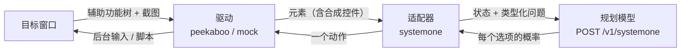

# 架构 · [English](architecture.md)

一次运行的每一步：观察目标窗口、问规划模型、执行、再观察。主循环（`deskmind_hands/runtime/loop.py`）负责预算、取消和失败分类；
驱动负责桌面；适配器负责规划模型。三者都看不到评分器的视角：评分器看文件系统，规划模型只看观察通道给它的东西。



## 观察与动作

- **用 bundle id，不用应用名。** 本地化系统上 `--app Finder` 会失败，`com.apple.finder` 则可以。
- **坐标系每次都重新推导。** 元素边界是全局显示点，图片是窗口裁剪、有自己的尺寸，缩放比也不是整数（一次截图给出的是 460×218，
  窗口是 820×374）。变换在每次观察时从截图上报的几何信息推导（只有 `geometry.py` 做这件事）。
- **动作绑定到某次观察。** 动作指向某次观察里的某个元素；任何动作之后该观察就作废，因此在过期布局上的动作会被拒绝，而不是点错地方。
- **“无法确认”是单独的结果。** 写入已发出但读不回来时，这一步报告为“无法确认，先观察再行动”，而不是一个会诱使规划模型重试的失败。

## 后台执行

驱动在一次运行中保持一个 Peekaboo MCP 会话（`HANDS_PEEKABOO_TRANSPORT=mcp`）。点击发给当前快照里的元素，文字作为辅助功能值写入，
快捷键投递到目标窗口。你正在用的应用保有键盘。macOS 没有后台通道的地方，这一步会带着原因被拒绝，而不是偷偷在前台完成：

- 某个应用在后台收不到的快捷键，根本不会提供给规划模型（`ROUTED_CHORDS`）；
- 完全不接受后台输入的应用，可以允许一次短暂的**前台闪点**（`HANDS_FLASH_APPS`，bundle id 列表）：应用被带到前台约一秒，
  点一下，指针放回原处，再把前台还给你的应用。你正在该应用里、或 3 秒内碰过键盘鼠标时，绝不会发生；
- 每一次前台操作都记入运行记录（`driver_state`），因为“不打扰你”是一个需要被测量的承诺。

## 投影层

读元素列表的规划模型在网页上表现不错，在访达里却很差，因为常用操作是一串选择和快捷键。投影层加入合成元素，也就是网页上会有的那些控件：

| 应用 | 合成控件 | 执行方式 |
|---|---|---|
| 访达 | 每个文件一个 *移动「文件」到 ▾*，选项是所有合法目的地 | 访达脚本 |
| 访达 | 新建文件夹的名称输入框 + *新建文件夹* 按钮 | 访达脚本 |
| 访达 | 显示方式下拉框；文件夹作为链接；撤销上一次改动的按钮 | 访达脚本 |
| 文本编辑 | *保存*、新建纯文本文稿、另存为（名称、位置、按钮） | 文本编辑脚本 |

每个合成元素都标记为 `synthetic`，每次使用都计数。会把运行带出工作目录的行（边栏收藏）不提供。`HANDS_PROJECTION=0`
关闭投影层，用来在原始辅助功能树上衡量规划模型；开与关的差别回答了一个问题：桌面需要的是新动词，还是只是新的状态形状。

## 类型化问题的规划接口

`adapters/systemone.py` 从不让模型用文字写动作。每一步是一个请求：

```json
{"model": "brain-4b",
 "state": {"page": {"url": "com.apple.finder", "title": "ws", "text": "..."},
           "elements": [...], "recent_actions": [...], "effects_so_far": [...]},
 "questions": {
   "operation":       {"type": "choice", "criteria": {"CLICK": "...", "TYPE_TEXT": "...", "SELECT": "...", "DONE": "..."}},
   "click_target":    {"type": "choice", "criteria": {"...": "..."}},
   "select_target":   {"type": "choice", "criteria": {"...": "..."}},
   "type_text_value": {"type": "choice", "criteria": {"...": "..."}}}}
```

回答是每个问题每个选项的概率。适配器执行概率最高的操作及其目标；置信度低时可以转给更大的模型。输入什么也是一个选择：
候选值来自目标里引号中的字符串、口述的整行文字和屏幕上的文字，因为桌面任务的目标通常会直接写出要输入的内容。

操作：`CLICK`、`OPEN`、`TYPE_TEXT`、`REPLACE_TEXT`、`APPEND_TEXT`、`TYPE_FOCUSED`、`SELECT`、`RENAME`、`KEY`、
`SCROLL`、`FOCUS_APP`、`FOCUS_WINDOW`、`ASK`、`ANSWER`、`DONE`、`BLOCKED`。只提供当前状态下适用的那些。

同样的 API 由 [DeskMind Brain](https://github.com/deskmind-ai/brain) 在本机提供。任何与 /v1/systemone 线协议兼容的其他服务，
都可以通过 `--systemone-url` 和 `SYSTEMONE_API_KEY` 使用；如果服务拒绝只有一个选项的选择题，设置
`SYSTEMONE_LOCAL_SINGLETONS=1`，这类问题会在本地直接作答。

## 失败分类

每次运行恰好归入一类（`deskmind_bench.failures`）：`none`、`planning`、`false_completion`、`no_progress_loop`、
`budget_exhausted`、`forbidden_side_effect`、`action_parse`、`wrong_target`，以及三类不算模型的错、按可用性而不是能力来报告的：
`environment`、`provider_unavailable`、`harness_bug`。
