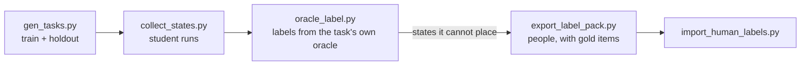

# Training data · [中文](data.zh-CN.md)

How the states a planner is trained on are produced: generate tasks, run a student, label every state it reached.
The public pipeline needs no cloud model, and every step can be checked offline; teacher labelling tools are not
part of this repository.



## 1. Tasks

`tools/gen_tasks.py` generates training tasks for the real desktop, one family per kind of diag task (new folder,
move up one or two levels, rename deep, sort into a folder, add a suffix, edit fields, write exact text, round trip
between documents, find a line in a long log, edit only the named one of two look-alike documents). Names, folders,
depths, fields, values and languages all vary, so what a model can learn is the decision, not the task. The thirteen
diag tasks of the benchmark never appear.

- `tasks/train`: 200 tasks, 20 per family.
- `tasks/holdout`: 42 tasks. The last phrasing of every family is held out of training, and two compositional
  families (create-then-move, rename-then-move) exist only here.

Every task carries an **effect oracle**: the shell commands that produce the correct end state. `deskmind-hands
verify-tasks --set train` proves each task is solvable and that doing
nothing fails it before a single state is collected. `tools/audit_candidates.py` checks, offline, that the right
answer is among the options the adapter would offer at every step of the oracle.

## 2. States

`tools/collect_states.py` runs a planner on a task set and writes one JSONL row per model call: the state and
questions exactly as sent, the planner's answer (every option's probability), what the harness then did and what the
environment said, and the run's final grade. Rows are appended as each run finishes; `--skip-done` resumes.

```bash
HANDS_PEEKABOO_TRANSPORT=mcp python tools/collect_states.py --set train --driver peekaboo \
    --model brain-0.8b --url http://127.0.0.1:8793 --role student --out data/student_train.jsonl
```

`tools/export_onpolicy.py` does the same on the mock desktop, fast enough for every checkpoint.

## 3. Labels

- **Oracle (DAgger).** `tools/oracle_label.py` works out what is still left to do for a recorded state (the oracle's
  effects minus what the run has verifiably done) and turns the first remaining effect into the answer to the
  questions the student was asked, in the same one-hot format:

  | remaining effect | label |
  |---|---|
  | `mkdir X` | TYPE_TEXT X into the new-folder field, then CLICK create |
  | `mv a/f b/` | SELECT *move f to* → b; if f is not in this window, OPEN the folder on its path |
  | `mv d/f d/g` | RENAME f to g |
  | `cat > F` | FOCUS_WINDOW F; TYPE_TEXT (new document) or REPLACE_TEXT one span (edit); CLICK save |
  | nothing | DONE |

  Only train tasks are accepted. States the oracle cannot place (a wrong folder with no way back on screen, an answer
  that is not among the options) are marked `pending`.
- **People.** `tools/export_label_pack.py` packages what is left, plus hidden gold items the oracle labelled, into a
  self-contained offline annotation page (`tools/label_pack_template.html`, guideline in
  `tools/label_pack_guide.md`). `tools/import_human_labels.py` scores each annotator on the gold items and merges only
  agreed answers.

Training itself is in [DeskMind Brain](https://github.com/deskmind-ai/brain).
