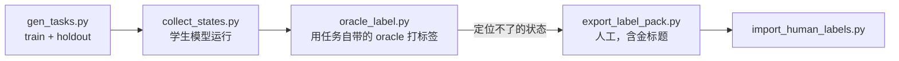

# 训练数据 · [English](data.md)

规划模型的训练状态从哪里来：生成任务、让学生模型去跑、给它到过的每个状态打标签。公开流程不需要云端模型，每一步都能离线检查；教师模型打标签的工具不在本仓库中。



## 1. 任务

`tools/gen_tasks.py` 为真实桌面生成训练任务，每类 diag 任务对应一个家族（新建文件夹、上移一层或两层、深入重命名、归类到文件夹、
加后缀、改字段、逐字写入、在文档之间往返、在长日志里找一行、在两份相似文档中只改指定的那份）。名字、文件夹、层级、字段、值、语言都会变，
所以模型能学到的是决策，而不是某个任务。基准里的 13 个 diag 任务从不出现。

- `tasks/train`：200 个任务，每类 20 个。
- `tasks/holdout`：42 个任务。每类的最后一种表述不进训练；两类组合任务（先建再移、先改名再移）只出现在这里。

每个任务都带**效果 oracle**：能产生正确终态的 shell 命令。`deskmind-hands verify-tasks --set train` 在采集任何状态之前，
先证明每个任务都可解、且什么都不做会失败。`tools/audit_candidates.py` 离线检查：oracle 的每一步，正确答案都在适配器会提供的选项里。

## 2. 状态

`tools/collect_states.py` 在一个任务集上运行规划模型，每次模型调用写一行 JSONL：原样发送的状态和问题、模型的回答（每个选项的概率）、
harness 随后做了什么、环境返回了什么，以及这次运行的最终评分。每跑完一次就追加；`--skip-done` 可以断点续跑。

```bash
HANDS_PEEKABOO_TRANSPORT=mcp python tools/collect_states.py --set train --driver peekaboo \
    --model brain-0.8b --url http://127.0.0.1:8793 --role student --out data/student_train.jsonl
```

`tools/export_onpolicy.py` 在模拟桌面上做同样的事，快到每个 checkpoint 都能跑。

## 3. 标签

- **Oracle（DAgger）。** `tools/oracle_label.py` 对一个记录下来的状态，算出还剩什么没做（oracle 的效果减去这次运行已经确认完成的部分），
  把剩下的第一个效果换算成学生模型当时所答问题的答案，格式同样是 one-hot：

  | 剩余效果 | 标签 |
  |---|---|
  | `mkdir X` | 在新建文件夹名称框 TYPE_TEXT X，然后 CLICK 新建 |
  | `mv a/f b/` | SELECT *移动 f 到* → b；如果 f 不在当前窗口，OPEN 路径上的文件夹 |
  | `mv d/f d/g` | RENAME f 为 g |
  | `cat > F` | FOCUS_WINDOW F；TYPE_TEXT（新文档）或 REPLACE_TEXT 一段（编辑）；CLICK 保存 |
  | 无 | DONE |

  只接受 train 任务。oracle 定位不了的状态（进了错的文件夹、屏幕上没有回去的路；答案不在选项里）标记为 `pending`。
- **人工。** `tools/export_label_pack.py` 把剩下的状态，连同一些由 oracle 标注、对标注者隐藏的金标题，打包成一个离线标注页面
  （`tools/label_pack_template.html`，指南见 `tools/label_pack_guide.md`）。`tools/import_human_labels.py` 用金标题给每位标注者打分，只合并一致的答案。

训练本身在 [DeskMind Brain](https://github.com/deskmind-ai/brain)。
